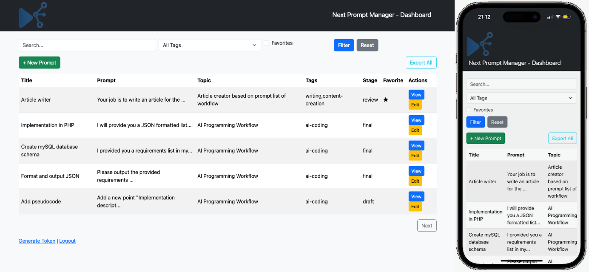
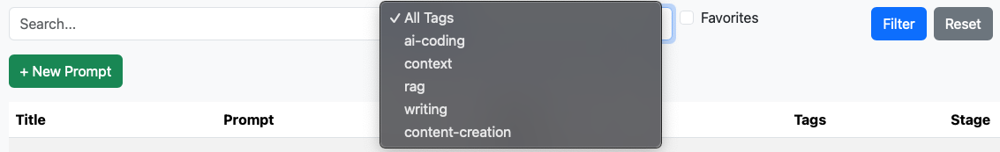
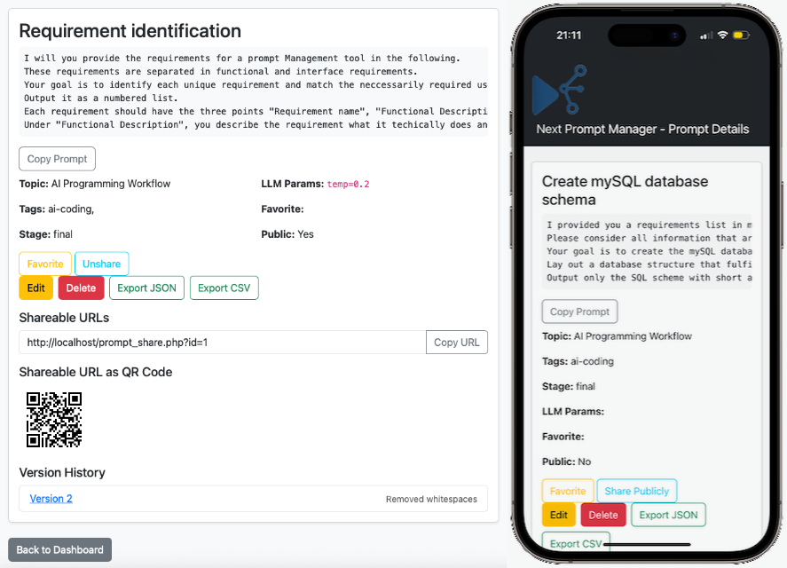

**Next Prompt Manager** is a minimal, web-based prompt management tool for storing, editing, versioning, sharing, and exporting prompts for LLMs and other AI workflows. It provides a clean, simple interface for managing prompts with metadata, version control, sharing, and API access, all protected by token-based access control.

> **Human note:**
> The whole application source code, DB schema,README and even the logo header was created by the GPT-4.1 LLM model. It should demonstrate that small software projects can be developed extremely fast with some knowledge about SW development and appropriate prompting methods. This app was created in a few hours and my PHP/Bootstrap knowledge is very low... 😉

---


## Key Features

- **Store Prompts with Metadata:**  
  Save prompts with description, topic, tags, stage, favorite flag, and LLM parameters.

- **Prompt Version Control:**  
  Every edit creates a new version with a change description. Browse and restore previous versions.

- **Dashboard with Pagination & Filters:**  
  View all prompts, search fulltext, filter by tags or favorites, and paginate through results.
  
  

- **Prompt Editing & Deletion:**  
  Edit prompts and metadata, or delete prompts with confirmation.

- **Favorite & Public Flags:**  
  Mark prompts as favorite or public for easier access and sharing.

- **Prompt Sharing:**  
  Share prompts via a public URL or a secure tokenized link. Copy shareable URLs to clipboard.
  

- **Export Prompts:**  
  Export one or all prompts as CSV or JSON files.

- **API Access:**  
  Retrieve prompts as raw JSON or add new prompts via HTTP API with token authentication.

- **Access Control:**  
  All main features require a valid access token. Public prompts can be accessed by anyone.

- **Token Management:**  
  Generate and manage unique access tokens for dashboard or prompt access.

- **Copy Prompt to Clipboard:**  
  Quickly copy prompt text for use elsewhere.

---

## Installation & Usage

### Requirements

- PHP 7.2+ with PDO MySQL extension
- MySQL database

### Setup

1. **Clone or Download the Repository**

   ```
   git clone https://github.com/yourusername/next-prompt-manager.git
   cd next-prompt-manager
   ```

2. **Configure Database**

   - Create a MySQL database (e.g., `next_prompt_manager`).
   - Import the provided SQL schema (see `schema.sql` if available).
   - Edit `config.php` to set your database credentials.
   > **Human note:** Because the token generation needs token authentication for safety reasons, this is some kind of lock-in. For this reason, I've added the INSERT into the DB schema that creates a "first-use token" 3141593. You can use this for initial login to create a new one. Please delete this token after first login!

3. **Set Up Web Server**

   - Place the files in your web root or configure a virtual host.
   - Ensure PHP can write to the directory if needed.

4. **Access the Application**

   - Open `login.php` in your browser.
   - Generate a dashboard access token at `token_generate.php` and use it to log in.

### Basic Usage

- **Dashboard:**  
  After login, you’ll see the dashboard to view, search, filter, and manage prompts.

- **Create/Edit Prompts:**  
  Use the "+ New Prompt" button or "Edit" on any prompt to add or modify prompts. Each edit requires a change description for version tracking.

- **Prompt Details:**  
  Click "View" to see full prompt details, version history, sharing options, and export/download buttons.

- **Sharing:**  
  Mark a prompt as public to share via a public URL, or share a tokenized link for private access.

- **Export:**  
  Export all or individual prompts as CSV or JSON.

- **API Usage:**  
  - **Get Prompt:**  
    `GET prompt_api.php?id=123&token=YOUR_TOKEN`  
    Returns prompt as raw JSON.
  - **Add Prompt:**  
    `POST prompt_api.php` with all fields and a valid dashboard token.

- **Access Control:**  
  All main features require a valid dashboard token. Public prompts are accessible without a token.

---

## Directory Structure

```
next-prompt-manager/
├── config.php
├── db.php
├── functions.php
├── index.php
├── login.php
├── dashboard.php
├── prompt.php
├── prompt_edit.php
├── prompt_delete.php
├── prompt_export.php
├── prompt_share.php
├── prompt_api.php
├── token_generate.php
├── assets/
│   └── style.css
```

---

## License

MIT License.

---

## Credits

Developed as a minimal, extensible solution for prompt management with full versioning, sharing, and API support. Contributions and improvements welcome!